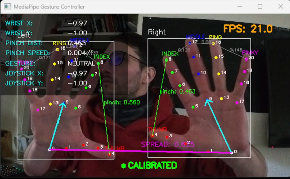
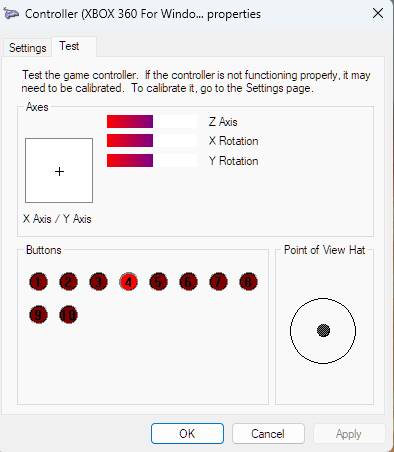
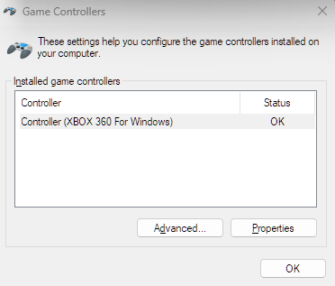

# VisionInput — Gesture Controller for Immersive Projection Environments

**VisionInput** is a plug-and-play gesture controller built for the James Hutton Institute's 360° immersive projection room in Aberdeen. It uses Google MediaPipe hand tracking to emulate an Xbox 360 controller, replacing physical input devices with natural hand gestures for navigating immersive content and applications.

Developed as an RGU Honours capstone project (CM4134), supervised by Dr John N.A. Brown.

---

## System Requirements

- **OS**: Windows 10 or Windows 11 (required for ViGEmBus)
- **Python**: 3.11 or 3.12 (project currently running on Python 3.12.6)
- **Driver**: [ViGEmBus Driver](https://github.com/nefarius/ViGEmBus/releases) — must be installed manually before running

---

## Current Stage (March 2026)

- Core real-time gesture-to-controller pipeline is implemented and stable.
- Split-hand controls are active (left hand movement and D-pad, right hand buttons/triggers).
- Visual debug overlay is available via `--visualise`.
- Latency logging is now implemented with per-session CSV output and auto timestamping.

---

## Hardware

### Developed & Tested On
- **CPU**: AMD Ryzen 9 5950X
- **GPU**: NVIDIA RTX 3090
- **RAM**: 64GB DDR4  3200Mhz
- **Camera**: Insta360 GO 3S (webcam mode) and Creative VF0700 webcam
- **Controller Reference**: Mappings verified against Razer Wolverine V2 using `joy.cpl`


*[Photo: camera mounted on tripod, hands in frame]()*

### Minimum Recommendations
VisionInput is designed to run on standard hardware.
- **Webcam**: Any USB webcam (720p or higher recommended)
- **CPU**: Any modern multi-core processor — MediaPipe runs on CPU
- **Lighting**: Consistent, adequate lighting is essential for stable hand tracking. Avoid backlighting.

---

## Installation

1. **Install ViGEmBus Driver**
   Download and run the latest installer from the link above. You should hear the Windows USB connection sound when the script starts successfully.

   

2. **Clone the Repository**
```powershell
   git clone https://github.com/MagixIsAvailable/rgu-capstone-mediapipe.git
   cd rgu-capstone-mediapipe
```

3. **Create a virtual environment and install dependencies**
```powershell
   py -3.11 -m venv .venv
   .\.venv\Scripts\Activate.ps1
   pip install -r requirements.txt
```

---

## Configuration

1. **Select your camera**
   Run the interactive camera selector to find and save your webcam index:
```powershell
   python src/setup_camera.py
```
   Press `y` to select a camera when the preview looks correct.

   

2. **Launch the controller**
```powershell
   python src/main.py
```
   Add `--visualise` to open a debug window showing the camera feed, hand skeleton, and live joystick values:
```powershell
   python src/main.py --visualise
```

   To collect latency trials:
```powershell
   python src/main.py --log-latency
```

   To run both overlay and latency logging:
```powershell
   python src/main.py --visualise --log-latency
```

---

## Controls & Gestures

VisionInput uses a split-hand control scheme. Both hands must be visible for full control.

**
**
**

### Left Hand — Navigation & D-Pad

Controls the **Left Analog Stick** and **D-Pad** simultaneously.

**Analog Stick (Movement)**
| Axis | Input | Action |
|:---|:---|:---|
| Horizontal (X) | Tilt wrist left / right | Strafe or turn |
| Vertical (Y) | Raise right hand relative to left | Move forward |
| Vertical (Y) | Lower right hand relative to left | Move backward |
| Vertical (Y) fallback | Tilt wrist up / down (single hand) | Move forward / backward |

**D-Pad — bend each finger independently**
| Gesture | D-Pad Output |
|:---|:---|
| Index finger bent | Up |
| Middle finger bent | Down |
| Ring finger bent | Left |
| Pinky finger bent | Right |

---

### Right Hand — Action Buttons

Two-layer gesture system. **Pinches take priority over bends.**

*[Photo: Windows Game Controllers test panel showing buttons lit]*

| Gesture | Controller Input |
|:---|:---|
| Index pinch | LB (Left Bumper) |
| Middle pinch | RB (Right Bumper) |
| Ring pinch | LT (Left Trigger) |
| Pinky pinch | RT (Right Trigger) |
| Index bent | A |
| Middle bent | B |
| Ring bent | X |
| Pinky bent | Y |
| Index + Middle bent | Back / View |
| Index + Ring bent | Start / Menu |
| Open palm | No input (neutral) |

---

## Tuning & Customisation

Edit the `CONFIG` dictionary at the top of `src/main.py` to adjust behaviour:

| Parameter | Effect |
|:---|:---|
| `TILT_GAIN` | How much wrist tilt produces full joystick deflection. Increase for less movement required. |
| `NEUTRAL_Y_OFFSET` | Vertical bias correction for single-hand Y-axis fallback. Tune if character drifts forward/backward when only one hand is visible. |
| `EMA_ALPHA` | Smoothing factor (0.0–1.0). Lower = smoother but slower response. Default 0.3. |

---

## Features

- **MediaPipe hand tracking** — real-time 21-landmark hand detection, runs locally with no cloud dependency
- **Two-layer gesture system** — pinches (triggers/bumpers) and bends (face buttons) as distinct input layers
- **Inter-hand angle control** — Y-axis driven by relative hand height, solving the Gorilla Arm fatigue problem inherent in position-based gesture systems
- **EMA smoothing** — per-hand exponential moving average reduces joystick jitter without adding perceptible lag
- **Dead zone** — suppresses accidental input when hands are near neutral position
- **WebSocket server** — optional gesture broadcast to browser-based frontends (disabled by default)
- **Debug overlay** — `--visualise` flag shows skeleton, joystick vector, and live values for tuning
- **Latency logging (session-based)** — `--log-latency` stores timing data to a new timestamped CSV for each run

### Latency Logging

- Enable with `--log-latency`.
- Stops automatically after `latency_trials` samples (default: 50).
- Output directory: `logs/latency/`
- File format per run: `latency_log_YYYYMMDD_HHMMSS.csv`
- CSV columns: `session_created_at`, `timestamp`, `gesture_label`, `hand`, `latency_ms`
- Completion message prints the full absolute path of the saved file.

### Web Interface (Experimental)
A 360° A-Frame viewer is included in `web/index.html`. To enable:
1. Set `WEBSOCKET_ENABLED = True` in `src/main.py`
2. Open `web/index.html` in a browser on the same machine

---

## Project Structure
```text
rgu-capstone-mediapipe/
├── config/              # Gesture mapping configuration
├── logs/
│   └── latency/         # Session-based latency CSV output (generated at runtime)
├── src/
│   ├── main.py          # Entry point, gesture logic, control pipeline
│   ├── vigem_output.py  # Virtual Xbox controller output layer
│   ├── setup_camera.py  # Camera selection utility
│   └── visualiser.py    # Debug overlay
├── web/                 # Experimental A-Frame 360° viewer
├── archive/             # Development history and prototypes
├── README.md
└── requirements.txt
```

---

## Troubleshooting

| Problem | Solution |
|:---|:---|
| No controller detected in game | Ensure ViGEmBus is installed. You should hear the USB sound when `main.py` starts. |
| Script exits immediately | Run `python src/setup_camera.py` to create a valid `camera_config.txt`. |
| Character drifts when hands are still | Adjust `NEUTRAL_Y_OFFSET` in CONFIG. Run with `--visualise` and read the WRIST Y value at your natural resting position. |
| Hand tracking unstable | Improve lighting. Avoid wearing gloves or having a busy background. |
| Pinch not registering | Bring fingertip closer to thumb. Ring and pinky require more deliberate contact than index. |

---

## License

MIT License


